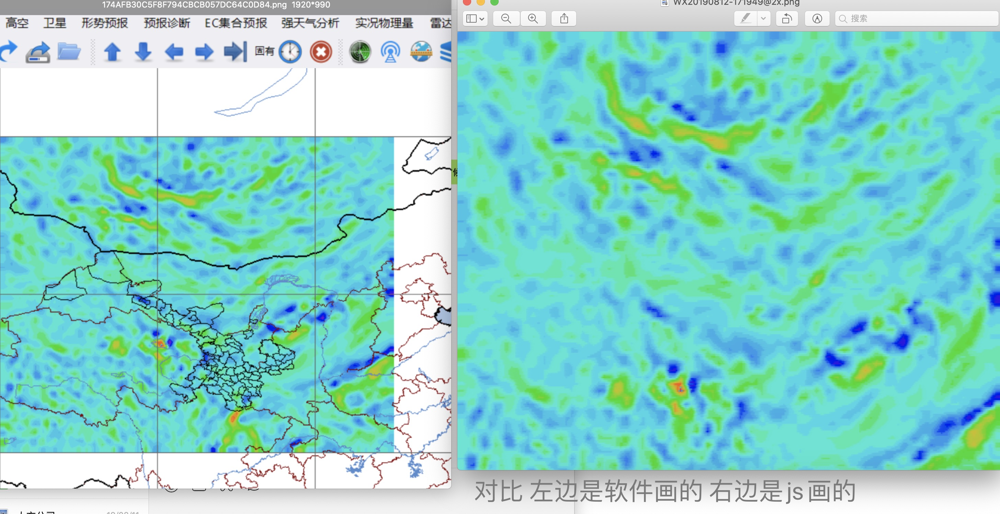
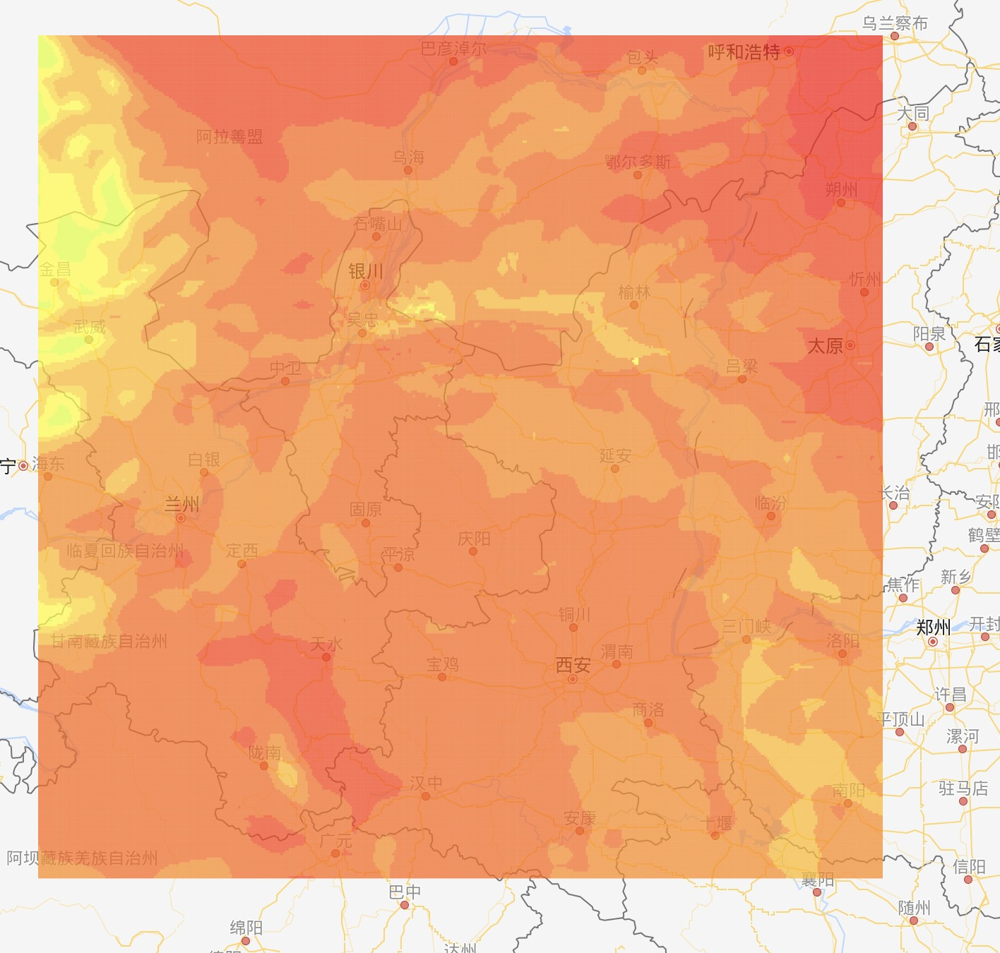
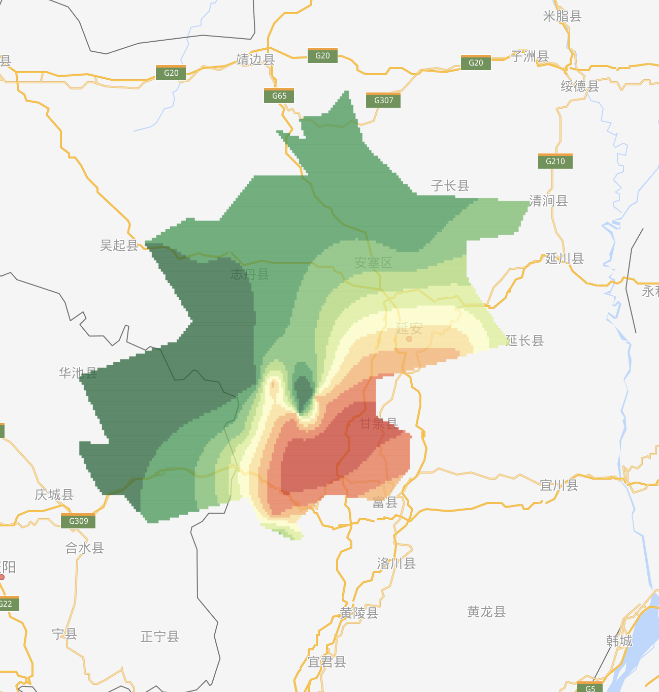
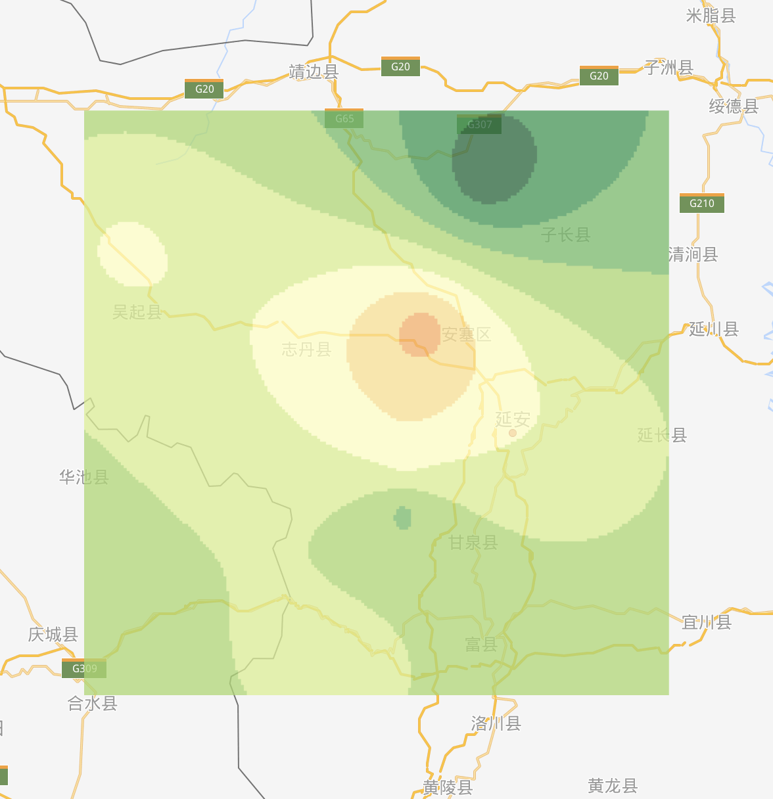
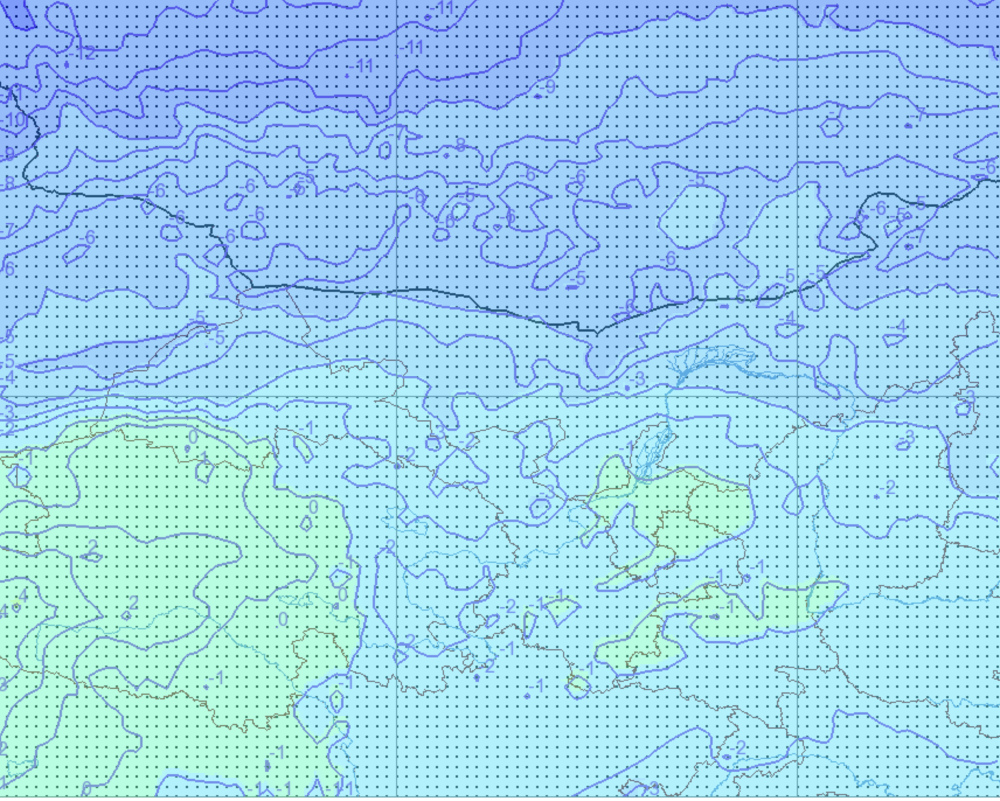

# Canvas绘图

```textile
前言 : 格点是直接解析的格点数据文件来绘图的. 站点是通过克里金差值来绘图的. 如果有问题, 可以提 但是不一定改 , 目的仅是减少同步绘图任务, 和节省空间. 

**栗子可以试 ,但是包含大量数据计算 所以 **
**不要用HBuilderX ! **
**不要用HBuilderX ! **
**不要用HBuilderX ! **
**如果你想看浏览器自己不停的刷新当我没说 **
```

```javascript
版本更新 : 
    1. >日期: 2019-08-23
       >文件: `_KrigingDarwCanvas.js` , `kriging.js`
       >更新说明: 添加了基于站点绘图的色标模式和普通模式的选择, 现在开始支持自定义颜色分级了! 操作方法更新在具体的说明里. 

    2.  >日期: 2019-08-27
        >文件: `_readFile.js`
        >更新说明: 因为经纬度 lat 在北半球 从大到小, 所以正常绘图会出现图片上下颠倒的情况, 在这里根据lat格距的正负作为依据, 进行x轴反转。 同时修复了一个压缩高宽后图只有一部分的问题
    3.  >日期: 2019-08-30
        >文件: `_readFils.js`
        >更新说明: 添加了一个属性 `_tarwidth` 用于限制canvas的高宽, 这里只需要宽度, 因为高度是等比计算的 .
            修复了一个如果数据小于色标的最小值,会导致颜色变为黑色的问题, 现在会正确的显示为透明, 如果绘图结果是斑点状. 考虑色标是否全面

    4.  >日期: 2019-09-24
        >文件: `readFile.jc.js`
        >更新说明 : meteinfo和micapes文件读取顺序不一样 不确定怎么读取, 新加了一个按着左上往下的顺序读取的方式
```











1. 通过站点绘图

> 引用: `jquery.js(3.0+)` `_ol_debug.min.js` `kriging.js` `_KrigingDarwCanvas.min.js` 
> 
> 说明: 
> 
> ```javascript
> 默认配置项: 
> _params : {
>     extent : [108,35,110.5,37.5],    //边界
>     maxValue:100,    //暂无用 
>     krigingModel:'exponential',//model还可选'exponential', 'gaussian','spherical'
>     krigingSigma2:0.1,    //权值, 如果站点多就写0 , 如果一片颜色就写0.1
>     krigingAlpha:100,   
>     canvasAlpha:0.75,//canvas图层透明度
>     colors:["#006837", "#1a9850", "#66bd63","#a6d96a", "#d9ef8b", "#ffffbf", "#fee08b", "#fdae61", "#f46d43", "#d73027", "#a50026"],//用于好看的颜色方案, _colorType: 'list'
>     colorsJson:[
>              {min : 0 , max : 10 , color : '#006837'},
>              {min : 10 , max : 20 , color : '#1a9850'},
>              {min : 20 , max : 30 , color : '#66bd63'},
>              {min : 30 , max : 40 , color : '#a6d96a'},
>              {min : 40 , max : 50 , color : 'red'},
>              {min : 50 , max : 60 , color : '#ffffbf'},
>              {min : 60 , max : 70 , color : '#fee08b'},
>              {min : 70 , max : 80 , color : '#fdae61'},
>              {min : 80 , max : 90 , color : '#f46d43'},
>              {min : 90 , max : 100 , color : '#d73027'},
>          ],
>     //用于自定义的颜色方案, _colorType: 'json'     <= min  > max
>     _colorType : 'list',
>     data : [],
>     dataType : 'json', // json , list
>     key : {
>         lat : 'lat',
>         lng : 'lng',
>         val : 'val'
>     },
>     tar : '#canvas',
>     create : false
> },
> ```
> 
> 怎么用:
> 
> ```javascript
> //let clipgeom = new ol.geom.Polygon(coord); 
> let _params = {
>     //extent : clipgeom.getExtent(),
>     dataType : 'list' ,
>     data : {
>         lat : lats,    //数组
>         lng : lngs,    //数组
>         val : vals     //数组
>     },
>     key : {
>         lat : 'lat',
>         lng : 'lng',
>         val : 'val'
>     },
>     tar : '#canvas',
>     //create : true,
>     //polygons : coord
> }
> _canvas = _darwCanvas._init(_params)._doit();
> 
> //html
> 
> <div id="canvas" >
>     <canvas  ></canvas>
> </div>
> 
> 说明: 1. 参数可以使用默认的不写就可以
>      2. 如果需要裁剪边界的. 把除了`create`的注释掉的放开就可以, `coord`是一个三维数组 是边界的数据 只需要在最里面的数据就可以了,大概长这样 : coord = [[[lng,lat],[lng,lat],[lng,lat],...]]
>      3. `dataType` 可以是json , {lat : '',lng : '', val : ''}的形势 , `data`写json的数据, `key`要和json里面的key对应
>      4. 如果是给地图叠加的图层不需要渲染到指定的canvas标签里的情况, `create`写成 `true`  `_canvas`会返回一个canvas对象 通过叠加图片的方法, 添加 `_canvas.toDataURL()`的图片对象就可以了. 
> ```

2. 通过解格点文件

> 引用: `jquery.js(3.0+)` `_readFile.min.js`
> 
> 说明: 这个js的方法之前解文件的里面有讲过一些, 同时修复了一些bug , 如果用单纯的解文件也建议用这个新的js文件 , 这里只单独说明绘图的方法 其他不多描述
> 
> ```javascript
> 默认配置项: 
> let _params = {
>     _gjLon : '',        //lon,lat的格距
>        _gjLat : '',
>     _lat_line_num : '',    //lat,lon在一行/列的数量
>     _lon_line_num : '',
>     _minLon : '',    //lon,lat的起始值
>     _minLat : '',        
>     _color : [[167,239,228],[170,237,211],[175,234,197],[165,229,179],[145,224,155],[125,216,127],[116,211,107],[112,206,90],[109,198,73],[108,193,56],[112,188,41],[116,181,27],[127,178,17],[255, 255, 255],[0,48,255],[0,121,255],[0,168,255],[0,204,255],[0,234,255],[0,255,198],[0,255,96], [150,255,0],[222,255,0], [255,252,0],[255,216,0],[255,186,0],[255,138,0],[255,102,0],[255,60,0],[255,0,0],[201,0,0],[149,0,0]],
>     _level : [-72,-68,-64,-60,-56,-52,-48,-44,-40,-36,-32,-28,-24,-20,-16,-12,-8,-4,-2,0,4,8,12,16,18,20,24,28,32,36,40,45],
>     _tar : '#canvas',
>     _create : false,
>     _alpha : 0.75,
>     _json : '',
>     _tarwidth : 6000
> }
> 
> 说明: 1. 这里用到的是温度的色标 , 数据和参数基本上也是读取自文件 所以使用的时候基本上是不需要改动的 , 色标格式和之前项目里用到的绘图的配置项是一样的格式直接复制过来即可
> ```
> 
> 怎么用
> 
> ```javascript
> let _read = new _readFileDiamond4('js/19080908.024'); 
> //_canvas = _read._draw();
> _canvas = _read._draw({_tar : '#b' , _create : true} );
> 
> 说明: 1. 参数可以使用默认的不写就可以
> 
>      2. 如果是给地图叠加的图层不需要渲染到指定的canvas标签里的情况, `_create`写成 `true` `_canvas`会返回一个canvas对象 通过叠加图片的方法, 添加 `_canvas.toDataURL()`的图片对象就可以了.
> ```
